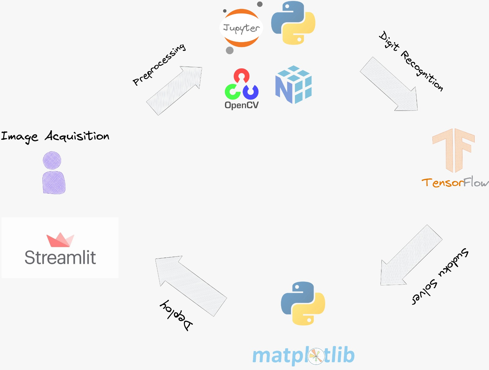
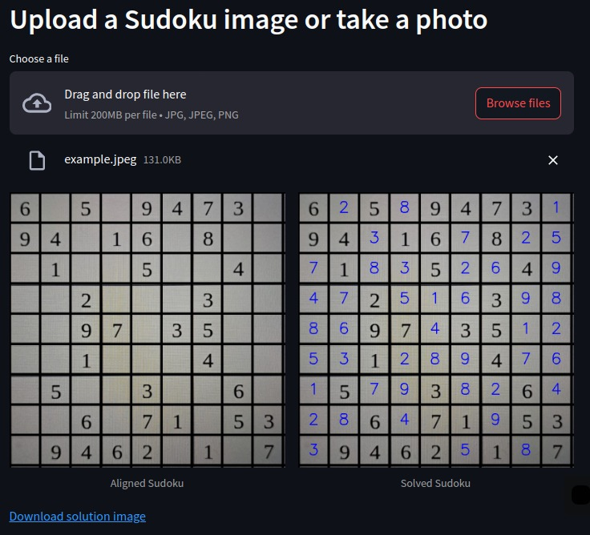

# Sudoku Solver using Computer Vision and Deep Learning

### Overview

This project solves Sudoku puzzles from images using computer vision and deep learning. It involves digit recognition, grid extraction, and recursive solution algorithms. Users can upload a Sudoku image or take a photo, and the application returns the solved puzzle.

<div align="center">
    
</div>

**Data Source**: The project relies on custom images of Sudoku grids and training data for digit recognition.


## Table of Contents
- [Project Features](#project-features)
- [Project Architecture](#project-architecture)
- [Technologies Used](#technologies-used)
- [Running the Application](#running-the-application)
- [Project Structure](#project-structure)
- [Usage Examples](#usage-examples)
- [Contributing](#contributing)
- [Contact](#contact)

## Project Features

- **Computer Vision Grid Detection**: Automatically detects and aligns the Sudoku grid from an image.
- **Digit Recognition Model**: Recognizes and classifies digits within the grid using a trained CNN model.
- **Sudoku Solver**: Solves the puzzle using a recursive backtracking algorithm.
- **Interactive Interface**: Displays results through an interactive Streamlit application.


## Project Architecture

Below is the high-level architecture of the project, including image acquisition, preprocessing, digit recognition, solution, and visualization stages.



1. **Image Acquisition**: Users can upload or capture images of Sudoku puzzles.
2. **Preprocessing & Grid Detection**: Applies computer vision techniques to detect and extract the Sudoku grid.
3. **Digit Recognition**: Classifies each cell using a convolutional neural network.
4. **Solving Algorithm**: Uses backtracking to fill in missing values in the Sudoku puzzle.
5. **Deployment**: Displays the solved puzzle within a Streamlit application.

---

## Technologies Used

- **Jupyter Notebooks**: For data exploration and code testing.
- **Python**: Core programming language.
- **OpenCV**: For image processing and analysis.
- **Streamlit**: For creating an interactive web application.
- **TensorFlow/Keras**: For training the convolutional neural network.
- **Pillow**: For image handling and manipulation.


## Running the Application

1. **Clone the Repository**:
   - First, clone the repository to your local machine:
     ```bash
     git clone https://github.com/Carlos93U/sudoku_vision.git
     cd sudoku_vision
     ```

2. **Install Dependencies**:
   - Install the required dependencies using `requirements.txt`:
     ```bash
     pip install -r requirements.txt
     ```

3. **Run the Streamlit Application**:
   - Start the app locally:
     ```bash
     streamlit run app/main.py
     ```
   - Access the application in your web browser at `http://localhost:8501`.


## Project Structure

The following is an overview of the main folders and files within the project.

```plaintext
sudoku_vision/
│
├── data/                       # Stores image data for training and testing
│   ├── cells/                  # Directory for storing cropped cell images
│   └── augmented_cells/        # Directory for storing augmented images
│
├── models/                     # Saved models for digit recognition
│
├── src/                        # Source code for core functionalities     
│   ├── preprocessing.py        # Image preprocessing and grid extraction
│   ├── digit_recognition.py    # Digit classification using CNN
│   ├── solver.py               # Recursive backtracking Sudoku solver
│
├── app/                        # Streamlit application files
│   └── main.py                 # Entry point for the Streamlit app
├── requirements.txt            # List of dependencies
└── README.md                   # Project documentation
              # Project documentation

```

## Usage Examples

### Sudoku Puzzle Solution

The application allows users to solve Sudoku puzzles from uploaded images, displaying the original puzzle and the solved puzzle side by side.

<div align="center">
    
</div>

## Contributing

If you would like to contribute to the project, please fork the repository and create a pull request with your proposed changes. All contributions are welcome.


## Contact

For any questions or feedback, please contact:

**Juan C. Huillcas**  
Email: [huillcas.juan3@gmail.com](mailto:huillcas.juan3@gmail.com)  
LinkedIn: [Juan C. Huillcas](https://www.linkedin.com/in/juan-carlos-huillcas)  

---
